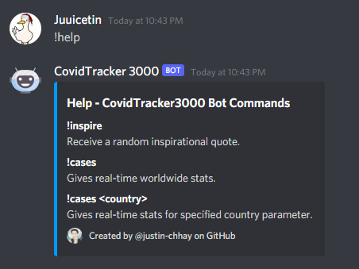
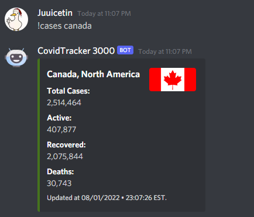

# Coronavirus Statistics Tracker Discord Bot
## Table of Contents
- [Description](#desc)
- [Technologies Used](#tech)
- [Getting Started](#start)
- [Obtaining Statistics](#stats)
- [Credits](#credits)

## Description 
I give real-time updates on news and statistics regarding Covid-19 in various countries! A personal side-project to help familiarize myself with Python and APIs.
## Technologies Used 
> Python, Discord.py, Open Disease API
## Getting Started 

` !h `

The help command simply lists all the available commands the Discord Bot has:
1. `!inspire` returns a random inspiration quote (taken from ZenQuotes API)
2. `!cases` returns up-to-date coronavirus statistics regarding the world
3. `!cases <country_name>` returns up-to-date coronavirus statistics for specified country in parameter

## Obtaining Statistics 

` !cases <country> `

The cases command simply displays up-to-date coronavirus-related statistics (active and recovered cases, deaths) for the world or specified country.

## Credits 
I took inspiration from the Discord Bot tutorial from Code Academy and expanded on my project creating new methods to pull data from open-source APIs for specifically Covid-19 related statistics.
[CodeAcademy YT Tutorial](https://www.youtube.com/watch?v=SPTfmiYiuok)
